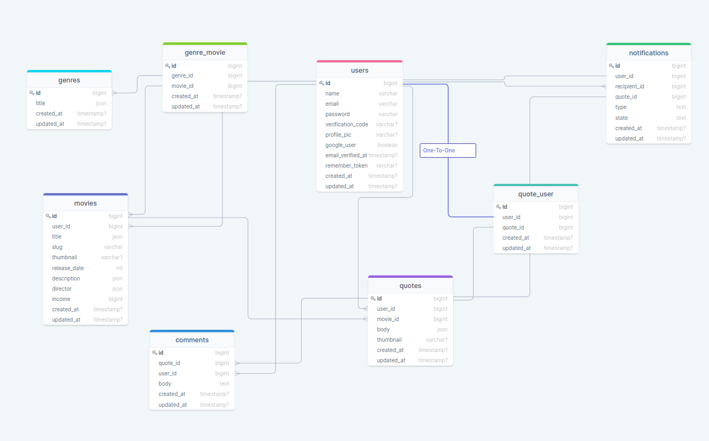

<div style="display:flex; align-items: center; justify-content:center">
  <h1 >Chad MovieQuotes API</h1>
</div>

---

This is an api for Chad Movie-Quotes app, where people can register and scroll through their feed, where they'll find variety of quotes written by other people.as an user, you can add your own movie, which then you'll attach quotes.you can also register with your google account. Users can change their email (if it's not a google account), username and password if they wish.The app has multi-language support - English and Georgian.

#

### Table of Contents

-   [Prerequisites](#prerequisites)
-   [Tech Stack](#tech-stack)
-   [Getting Started](#getting-started)
-   [Migrations](#migration)
-   [Development](#development)
-   [DrawSQL](#drawsql)

#

### Prerequisites

-    *PHP@8.1 and up*
-    _MYSQL@8 and up_
-    _npm@6 and up_
-    _composer@2 and up_

#

### Tech Stack

-    [Laravel@8.x](https://laravel.com/docs/8.x) - back-end framework
-    [JWT Authentication](https://jwt-auth.readthedocs.io/en/develop/laravel-installation/) - JSON Web Token Authentication
-    [Spatie Translatable](https://github.com/spatie/laravel-translatable) - package for translation
-    [Laravel Echo](https://github.com/laravel/echo) - library for listening to broadcast by server-side broadcasting driver

#

### Getting Started

1\. First of all you need to clone Coronatime repository from github:

```sh
git clone https://github.com/RedberryInternship/coronatime-Giorgi-Pantsulaia.git
```

2\. Next step requires you to run _composer install_ in order to install all the dependencies.

```sh
composer install
```

3\. after you have installed all the PHP dependencies, it's time to install all the JS dependencies:

```sh
npm install
```

and also:

```sh
npm run dev
```

4\. Now we need to set our env file. Go to the root of your project and execute this command.

```sh
cp .env.example .env
```

And now you should provide **.env** file all the necessary environment variables: <br>
**MYSQL:**

> DB_CONNECTION=mysql <br>
> DB_HOST=127.0.0.1 <br>
> DB_PORT=3306 <br>
> DB_DATABASE=**\*** <br>
> DB_USERNAME=**\*** <br>
> DB_PASSWORD=**\***

#

after setting up **.env** file, execute:

```sh
  php artisan key:generate
```

Which generates auth key.

**and** :

```sh
  php artisan jwt:secret
```

Which generates secret key for jwt authentication

5\. In order for you to be able to send emails, you need to configure gmail mail service (or other mail-sending service):
https://myaccount.google.com/security?hl=en

6\. App uses pusher (https://pusher.com/) for real-time broadcasting, so you need to configure it in .env file:

> PUSHER_APP_ID=**\*** <br>
> PUSHER_APP_KEY=**\*** <br>
> PUSHER_APP_SECRET=**\*** <br>
> PUSHER_APP_CLUSTER=**\***

##### Now, you should be good to go!

#

### Migration

if you've completed getting started section, then migrating database if fairly simple process, just execute:

```sh
php artisan migrate
```

#

### Development

You can run Laravel's built-in development server by executing:

```sh
  php artisan serve
```

### DrawSQL

Also, Check out tables for MovieQuotes app.

https://drawsql.app/teams/redberry-19/diagrams/moviequotes-chad


